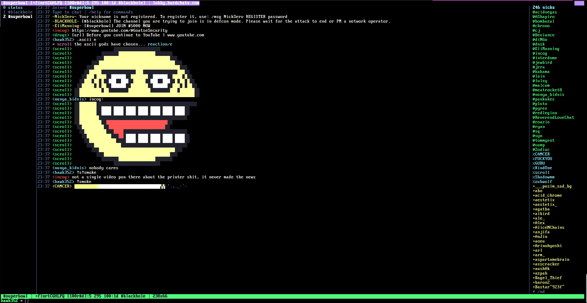

# irctun

Get on [SuperNets IRC](https://supernets.org) from any terminal. No client needed — just telnet or netcat.

## Connect

```bash
telnet irctun.supernets.org 6667
```

or

```bash
nc irctun.supernets.org 6667
```

You get a WeeChat-style TUI with channel list, nicklist, color-coded messages, and PM windows — rendered entirely with ANSI escape codes over a raw TCP connection.



## Build & Run (tunnel)

```bash
cd tunnel
go build -o tunnel .
./tunnel
```

Listens on `:6667`. Connects users to `irc.supernets.org` and auto-joins `#superbowl`.

## TUI Commands

| Command | Description |
|---------|-------------|
| `/join #channel` | Join a channel |
| `/part` | Leave current channel |
| `/sw <N\|#chan>` | Switch window |
| `/msg <nick> [text]` | Open PM window |
| `/query <nick>` | Open PM window |
| `/close` | Close current window |
| `/nl` | Toggle nicklist |
| `/cl` | Toggle channel list |
| `/rd` | Redraw screen |
| `/help` | Full command list |
| `↑` + Enter | Recall last command |

---

###### Mirrors: [SuperNETs](https://git.supernets.org/acidvegas/irctun) • [GitHub](https://github.com/acidvegas/irctun) • [GitLab](https://gitlab.com/acidvegas/irctun) • [Codeberg](https://codeberg.org/acidvegas/irctun)
